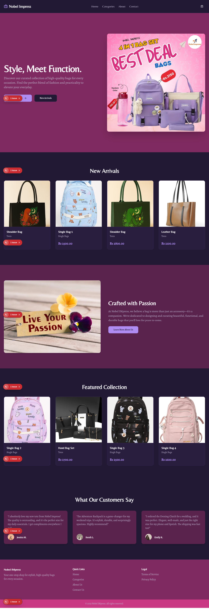

# Nobel Impress

Nobel Impress is a modern e-commerce web application focused on providing a curated collection of high-quality bags for every occasion. The project is built using Next.js with TypeScript and leverages React components for a responsive and dynamic user experience.

*Designed and developed by Zahida Parveen*

## Screenshots



## Features

- Hero section showcasing featured products with high-quality images.
- Product listing with lazy loading for performance optimization.
- Detailed product pages with breadcrumb navigation.
- Shopping cart with add, remove, and update quantity functionality.
- Checkout page with form validation and order submission.
- Responsive navigation menu with smooth toggle animations.
- Image optimization script for better web performance.
- Context API for managing cart state globally.

## Technologies Used

- Next.js (React framework)
- TypeScript
- React Context API
- Tailwind CSS for styling
- Firebase Firestore for order storage
- React Hook Form with Zod for form validation
- Lucide React for icons
- Image optimization using ImageMagick (via optimize-images.sh script)

## Project Structure

- `src/app/` - Main application pages including home, product details, cart, checkout, categories, and about pages.
- `src/components/` - Reusable UI components such as product cards, layout components (Header, Footer), and UI primitives.
- `src/context/` - React Context providers for global state management (e.g., CartContext).
- `src/lib/` - Utility functions and product data.
- `public/images/` - Static images used throughout the site.
- `optimize-images.sh` - Bash script to optimize and resize images for better performance.

## Performance Improvements

- Memoized Header component to reduce unnecessary re-renders and improve navigation responsiveness.
- Smooth transition effects added to mobile menu toggle.
- Image optimization script to resize and compress images.
- Lazy loading implemented for product images to improve page load times.

## Getting Started

### Prerequisites

- Node.js (v16 or higher recommended)
- npm or yarn
- ImageMagick installed for image optimization script

### Installation

1. Clone the repository:

   ```bash
   git clone <repository-url>
   cd Nobel-impress
   ```

2. Install dependencies:

   ```bash
   npm install
   # or
   yarn install
   ```

3. Run the development server:

   ```bash
   npm run dev
   # or
   yarn dev
   ```

4. Open [http://localhost:3000](http://localhost:3000) in your browser to see the app.

### Image Optimization

To optimize images, run the provided script:

```bash
bash optimize-images.sh
```

This will resize and compress images in the `public/images` directory and save optimized versions in `public/images/optimized`.

## Contributing

Contributions are welcome! Please open issues or submit pull requests for improvements or bug fixes.

## License

This project is licensed under the MIT License.
